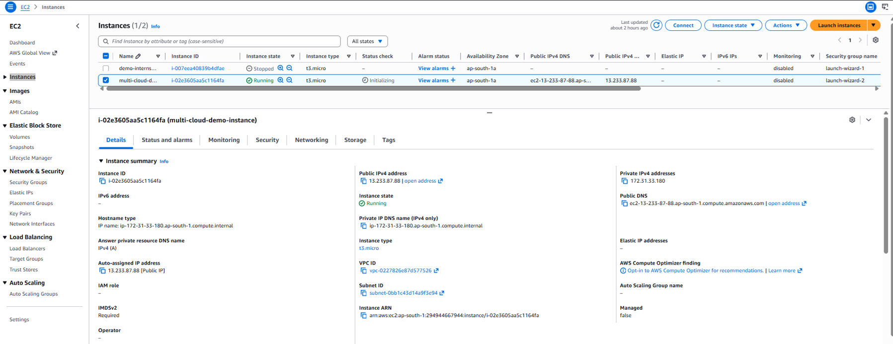
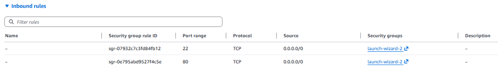
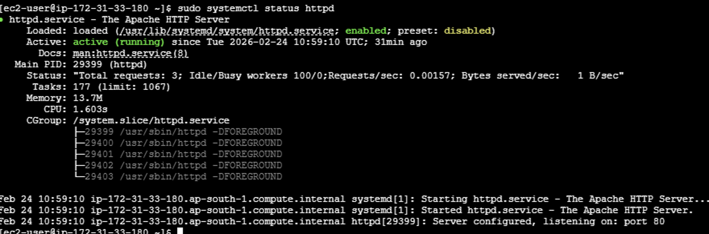
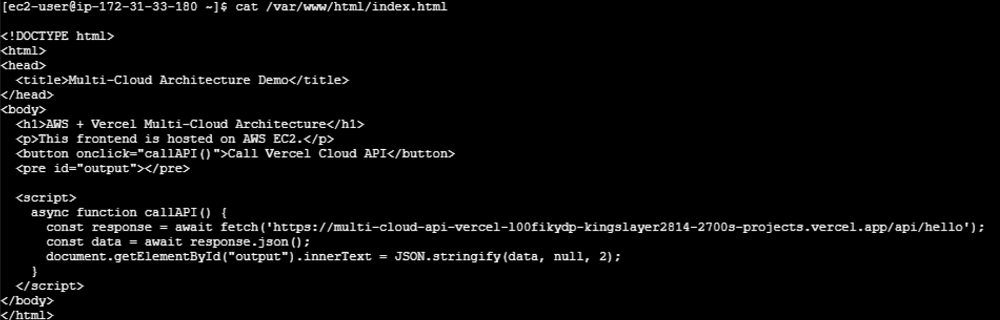
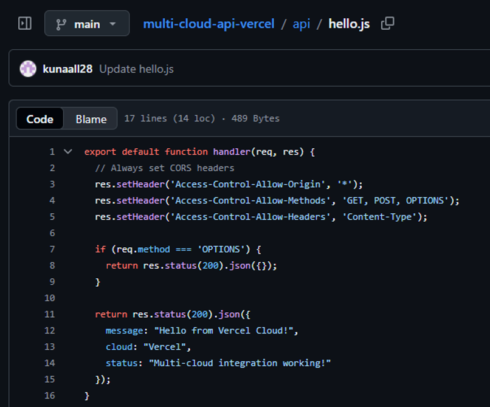
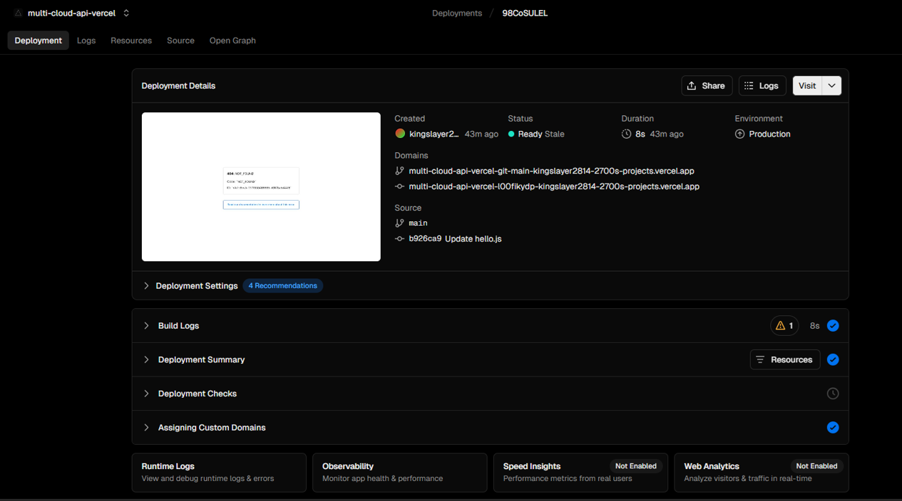
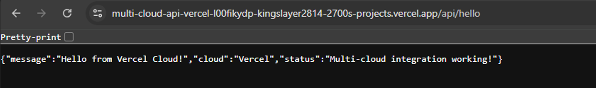
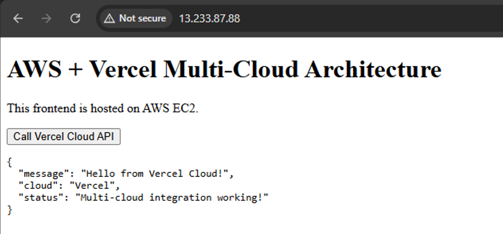

#Task 3 : Multi-Cloud Architecture using AWS and Vercel

📌 Objective
To design and implement a multi-cloud architecture where application services are distributed across two cloud platforms and demonstrate interoperability between them.

________________________________________

☁️ Cloud Platforms Used
- **Cloud Provider 1:** Amazon Web Services (AWS)
- **Cloud Provider 2:** Vercel (Serverless Cloud Platform)

________________________________________

🏗 Architecture Overview
In this implementation:
- The **frontend** is hosted on an AWS EC2 instance using Apache.
- The **backend** is implemented as a serverless function on Vercel.
- The AWS frontend communicates with the Vercel backend through HTTP API calls.

________________________________________

🛠 Implementation Details

1️⃣ EC2 Instance Details (AWS)
An EC2 instance was launched using AWS Free Tier.  
This instance hosts the frontend web application.

________________________________________

2️⃣ Security Group Configuration
Inbound rules were configured to allow:
- HTTP (Port 80)
- SSH (Port 22)

________________________________________

3️⃣ Apache Web Server Status
Apache was installed and verified to be running on the EC2 instance using the following command:

``bash
sudo systemctl status httpd

________________________________________

4️⃣ Frontend Code on AWS
The frontend HTML file was created on the EC2 instance and contains JavaScript code to call the Vercel API.

cat /var/www/html/index.html

________________________________________

5️⃣ Backend Serverless Function (Vercel)
A serverless function (hello.js) was created on Vercel to return a JSON response.
CORS was enabled to allow cross-cloud communication.

________________________________________

6️⃣ Vercel Deployment Details
The backend was successfully deployed on Vercel, generating a public API endpoint.

________________________________________

7️⃣ Backend API Output
The Vercel API endpoint was tested directly and returned the expected JSON response.

________________________________________

8️⃣ Final Multi-Cloud Integration Output
The AWS EC2 public IP was accessed via a browser.
Upon clicking the button on the webpage, a request was sent to the Vercel backend, and the JSON response was displayed successfully.

________________________________________

🔄 Workflow Summary
1.	User accesses the frontend hosted on AWS EC2.
2.	Frontend sends an HTTP request to the Vercel serverless API.
3.	Vercel processes the request and returns a JSON response.
4.	The response is displayed on the AWS-hosted webpage.
________________________________________

📊 Results
The multi-cloud architecture functioned successfully.
AWS and Vercel communicated seamlessly, demonstrating real-time interoperability between two different cloud platforms.
________________________________________

✅ Conclusion
This task demonstrates the implementation of a real-world multi-cloud architecture using AWS and Vercel.
By distributing services across multiple cloud providers, the architecture achieves flexibility, scalability, and vendor independence.

